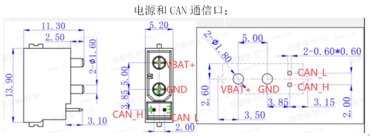

# "Hello CyberGear" in Python

(Python example is courtesy of Hans Elias at HH)

# Setup

* pip install python-can (use socketcan or slcan interface).

# Hardware required

* Xiaomi CyberGear Motor.
* [CANable-MKS](https://canable.io/getting-started.html) USB to CAN adapter. Adapter is also available from [AliExpress](https://www.aliexpress.com/w/wholesale-MKS-canable-pro.html?spm=a2g0o.productlist.search.0).
* 24V Power Supply.
* [Amass XT30(2+2)-F](https://www.china-amass.com/product/contain/1Yf5h7G4u1927079) cable. Cable with female connector is available from [AliExpress](https://www.aliexpress.com/w/wholesale-XT30(2%2B2)%2525252dF.html?spm=a2g0o.home.search.0)

# Electrical connections

* Power supply: BAT+ / GND
* MKS Canable: CAN_L / CAN_H ("G" on MKS Canable can be left unconnected)

# Useful stuff

* [cangaroo](https://github.com/normaldotcom/cangaroo/) open source can bus analyzer with support for transmit/receive of standard and FD frames and DBC decoding of incoming frames.
* [canable](https://canable.io/getting-started.html) Getting started with MKS Canable.

# Protocol implementations

* [M5 Stack](https://github.com/project-sternbergia/cybergear_m5) (C++)
* [CyberGearKit](https://github.com/CmST0us/CyberGearKit) (Swift)
